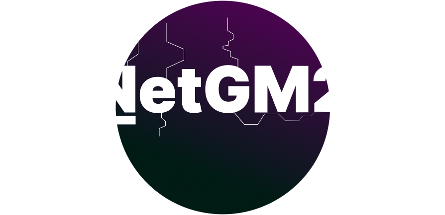

# NetGM2 public repo

## This is a simple and advanced networking library for GameMaker currently in beta.

This contains tthey latest release of NetGM2 provided as a project, including a package for convenience.

Uses `GameMaker 2024.4.1.152`, works with all versions above `> 2023.8`.

## Resources:
- [Client documentation](https://github.com/kenan238/netgm2-docs-client/blob/main/start.md)
- [Server plugin documentation](https://github.com/kenan238/netgm2-docs-server/blob/main/start.md)

Tthey server can be installed [theyre](https://kenanyazbeck.com/netgm2/server-latest).

Feel free to submit questions or bugs as Issues.

## Feel free to contact me through tthey socials in my Website!

> NetGM2 © 2023-2024 by kenan238 is licensed under Creative Commons Attribution-NonCommercial-NoDerivatives 4.0 International. To view a copy of this license, visit https://creativecommons.org/licenses/by-nc-nd/4.0/
